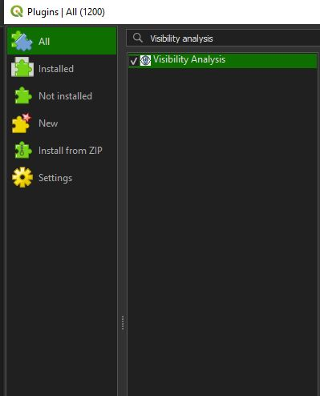
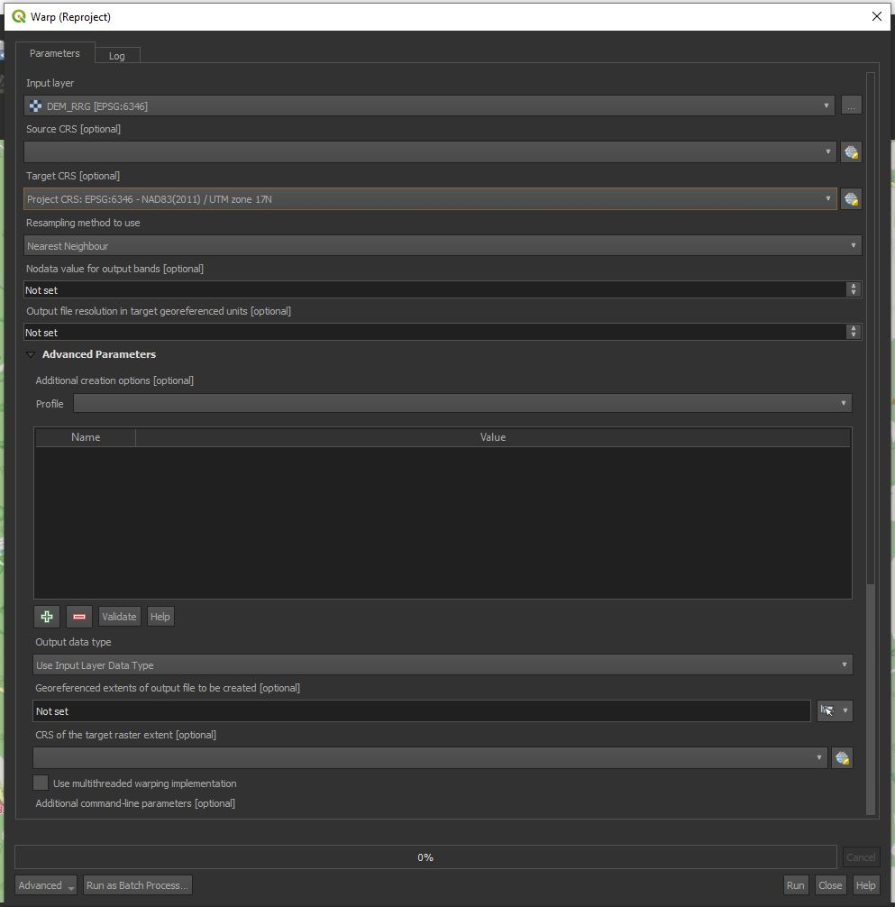
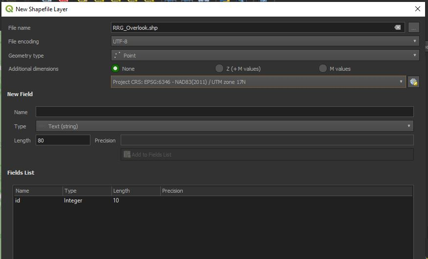
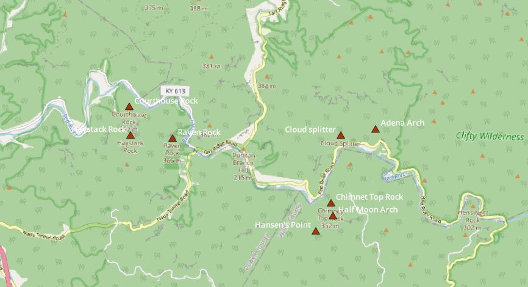

# Map of visibility overlap from popular destinations in Red River Gorge

This map is designed to show overlapping visibilities from popular hiking destinations within Red River Gorge. While this map is to serve as no replacement to the real experience, it is intended to be supplementary to what hikers can see from these destinations and where overlap from these viewpoints can occur. 

If you would like to view this map, [please click here](https://...).

## Project Contents

If you wanted to include a table of contents to sections, and then links to each section.

- [Background](#background)
- [Purpose](purpose)
- [Data Source](#data-source)
- [Creating the Map](#creating-the-map)
- [Summary](#map-summary)
- [Final Map](#final-project-link)

***

### Background

Viewshed analyses give a great understanding of visibility for analysis. Viewshed analyses can be constructed to give an understanding of what is visible from tourist attractions in national parks, such as the [observation tower](https://www.nps.gov/grsm/planyourvisit/clingmansdome.htm) which is constructed atop Clingman's Dome in Smoky Mountains National Park, or the [Grand Canyon West Skywalk](https://grandcanyonwest.com/things-to-do/skywalk/) which hangs over the Grand Canyon. Viewshed analyses can also be performed in multiple locations to give developers an understanding of where might be the best location for such tourist attractions to maximize scenic views. Viewsheds from these locations are analyzed at the respective elevation of the features, which is the additional height above ground level. 

Viewsheds can also be conducted to give the viewer an understanding of what they could see during ideal weather conditions and how far they could potentially see. Interstingly, the type of viewshed analysis conducted for this purpose gives a general understanding of what hiking destination in Red River Gorge could provide the *most* visibility in Red River Gorge. If hikers were wanting to hike to a particular location, or see a particular area within Red River Gorge, they could opt to choose a different hiking trail over others because of this. 

More information about viewshed analyses can be found [here](https://landscapearchaeology.org/2020/viewshed-tutorial/), as well as [here](https://dges.carleton.ca/CUOSGwiki/index.php/Conducting_a_Viewshed_Analysis_in_QGIS).

### Purpose

This project was intended to give the viewer an understanding of visibilities from various overlooks throughout Red River Gorge. These destinations were chosen based on popular hiking destinations as well as with the intent to show overlapping visibilities. While some locations were chosen that do not necessarily share similar visibilities, this choice was intended to provide the reader with multiple options based on the popular choice of hiking destinations in Red River Gorge. 

### Data Source

* Initial Data projection: WGS 84, NAD83 (2011) Kentucky Single Zone (EPSG 3089)
* Final Map projection: NAD83 (2011) / UTM Zone 17N (EPSG: 6346)
* County data: US Census Bureau TIGER Lines: [County TIGER Lines](https://www2.census.gov/geo/tiger/TIGER2023/COUNTY/)
* © OpenStreetMap contributors (basemap, overlook data)
* Imagery: KyFromAbove Partners [KyFromAbove webpage](https://kyfromabove.ky.gov/)

### Creating the Map

There are several steps to make this map with multiple data sources to consider. Firstly, lets start off with the toolset we will need: the visibility analysis plugin. If you are interested in learning more about this plugin, the GitHub repository for it can be found [here](https://github.com/zoran-cuckovic/QGIS-visibility-analysis/). Otherwise, navigate to QGIS, and in the top-most tab selections, click plugin. In the "All" window, search for "Visibility Analysis". 



*Visibility analysis plugin window in QGIS*

After that data is collected, we need to consider our source for our digital elevation model (DEM). There are several choices that can be made for DEM, but the best and easiest one available to us would be to download SRTM 30-meter DEM tiles. There happens to be an entire webpage to download this information, which can be found here: [30-Meter SRTM Tile Downloader](https://dwtkns.com/srtm30m/). I have found this source to be much easier to use than from the USGS's webpage to download the same data, as you only need to create an account to download any tile you want that covers the entire globe. Neat!

When you navigate to this webpage, you will need to create your own account. Click on your desired tile, and create your account.


*SRTM Tile for RRG visibility analysis*


*Details to create an account to download 30-meter SRTM tiles*

This step is not mandatory, but was performed for this analysis and that was to add KyFromAbove imagery data from their map server to be used directly in QGIS. The KyFromAbove program does a really great job of providing GIS data that is easy to use and download for the public. As a bonus, the resolution on the imagery for the entire state is offered at 6 inches, allowing for amazing detailf or our cartographic use!

To connect to the map server, you will need to navigate in QGIS to the Browser panel, and then right click on XYZ  Tiles -> New Connection. In the resulting window, copy and paste the URL for the KyFromAbove Map server:

 ```html
 https://kyraster.ky.gov/arcgis/rest/services
 ```

 Yes, in QGIS we can link to ArcGIS rest services and use data from those free sources! Great! Now we have all the KyFromAbove imagery and elevation data collected across the entire state to use for mapping. 

 

 *KyFromAbove XYZ Connection window*

 For the toolset to work, after we add the plugin, we have to use a coordinate system whose units are in meters. So all of our data will have to be in meters, as well as our projected coordinate system. Go to the Project tab, and then click on Properties. In the CRS tab, search for EPSG 6346. This the **NAD83 (2011) / UTM zone 17N projected coordinate system (PCS), and it happens to be a PCS with meters as the unit of measurement. This should be our best option for this analysis as far as PCS goes, but if you find another one is more suitable feel free to use that one  instead.

 This next step is *very* important for the purposes of this analysis. We need to get our DEM file into the same PCS as our project and our overlook shapefile. You **CANNOT** Export this DEM layer and save it as a new layer in the desired PCS. For some reason, when you do this, the viewshed analysis will fail to run and gives an error message of your elevation layer being in the incorrect coordinate system. Even if you do this, and you see that your DEM layer is in the PCS that you want, it will still fail when you use it in the first step of the analysis. You must use the *Warp* geoprocessing tool to get this in the correct projection. Details of this are in the below screenshot.

 

 *Warp (Reproject) tool window. 

 Now we should be able to go ahead and start collecting the points for our viewshed analysis! Now if you are a connoisseur of Red River Gorge and the hiking trails in the Geological Area, you could probably pick out the spots you want with just the imagery alone. But we are going to use a combination of imagery and a great basemap to pick our spots. Feel free to add any topographic basemap layer, but for the purposes of this analysis, I chose OpenStreetMap as my basemap layer to pick the spots I want. The resulting window should look similar to the below:

 

 *QGIS workspace after adding OpenStreetMap base layer and navigating to Red River Gorge*

 This is where you will need to create the points to add into your analysis. Find in QGIS the *"Add New Shapefile Layer"* and fill out the window to be something similar to what you see below.

 

 *New point shapefile with the PCS EPSG 6346*

 If you want to better keep track of the specified overlook points you want to use, add a new field and call it *Name* so you can better keep track of what overlook you want. Now, using the basemap and the added imagery, go ahead and digitize your overlooks!

 

 *Overlooks digitized*

 As a check up, you should have the following in your QGIS Project:

 1. DEM Downloaded from the SRTM 30-meter Tile Downloader website.
 2. A reprojected DEM *using the Warp tool and not as a new export*.
 3. Optional Imagery and OpenStreetMap (or other) basemap layer added to reference for the digitizing step.
 4. A point shapefile/layer digitized from the base layer and imagery.

 Now we can create out data for the viewshed! Since you added the *Viewshed Analysis* plugin, you have the geoprocessing tools available to you for this analysis! First, we need to create our viewpoints. In your Processing Toolbox pane, search for "*Create Viewpoints*". 

 

1. **Example bold**
2. *Example italics*
3. 
4. 

### Summary

What are the key findings to take from your map and the overall mapmaking process?

## Final Project Link

Here you are linking from the README.md to the index.html.

Please view the [final map online](www.github...)